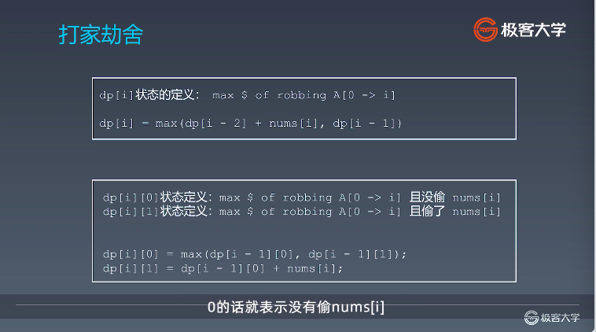
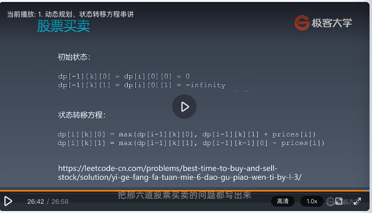

# 极客大学「算法训练营-第11期」作业提交仓库


## 讲师课件下载地址

请大家通过该链接查看讲师课件并进行下载，课件链接:https://pan.baidu.com/s/1NBNdjXI0tjDzNKXf8fvaQQ  密码:kmxb

## 仓库目录结构说明

1. `week01/` 代表第一周作业提交目录，以此类推。
2. 请在对应周的目录下新建或修改自己的代码作业。
2. 每周均有一个 `REDAME.md` 文档，你可以将自己当周的学习心得以及做题过程中的思考记录在该文档中。

## 作业提交规则
 
1. 先将本仓库 Fork 到自己 GitHub 账号下。
2. 将 Fork 后的仓库 Clone 到本地，然后在本地仓库中对应周的目录下新建或修改自己的代码作业，当周的学习总结写在对应周的README.md文件里。
3. 在本地仓库完成作业后，push 到自己的 GitHub 远程仓库。
4. 最后将远程仓库中当周的作业链接，按格式贴到班级仓库对应学习周的issue下面。
5. 提交issue请务必按照规定格式进行提交，否则作业统计工具将抓取不到你的作业提交记录。 

详细的作业提交流程可以查阅：https://shimo.im/docs/m5rtM8K8rNsjw5jk/ 


## 注意事项

 如果对 Git 和 GitHub 不太了解，请参考 [Git 官方文档](https://git-scm.com/book/zh/v2) 或者极客时间的[《玩转 Git 三剑客》](https://time.geekbang.org/course/intro/145)视频课程。

## 毕业总结：
练习思想：

化繁为简、数学归纳法思想

1、人肉递归低效、很累

2、找到最近最简的方法，将其拆解成可重复解决的问题

3、数学归纳法思想

学习要点：

基本功是区别业余和职业选手的根本、深厚的功底来自于--过遍数

最大的误区：只做一遍

五毒神掌

刻意练习-练习缺陷弱点地方，不舒服、枯燥

反馈-看题解、看国际版。

经典习题：

爬楼梯、硬币兑换

括号匹配、括号生成、直方图最大面积、滑动窗口

二叉树遍历、分层输出树、判断二叉排序树

股票买卖、偷房子、字符串编辑距离、最长上升子序列、最长公共子序列

异位词（判断和归类）、回文串（最大回文串）、regex和通配符匹配

高级数据结构（trie、BloomFilter 、LRU cache）


五毒神掌：

第一遍：思考五分钟，不会立即看题解（一定要看国际版的高票回答）

第二遍：自己写

第三遍：24小时后

第四遍：一周后

第五遍：复习

面试：

40~45分钟；1~3个题目；速度和能力

正确的预期：不是是否正确的完成题目

简单题、难题

代码10-30行；找最近重复性；关系：未来同事，共同解决问题；

简单题：开胃菜、快速解决

解题：

1、Clarification：明确题目意思、边界、数据规模

2、Possible solutions：穷尽所有可能的解法

3、Coding：代码简洁、高性能、美感

4、Test cases

解题模板:

递归复习：

```go
//模板 
func recur() {
    //terminator
  if a = b {
    return
  }
  //process current logic
  process(level,param)
  
  //drill down
  recur(level+1,newParam)
	
  //restore current status
}
```

分治（分而治之）

用递归（经常用的习惯）

```go
//模板
func divide_conquer(problem) {
    //recursion terminator
    if true {
        return
    }
    //prepare data
    data := prepare_data(problem)
    subproblems := split_problem(prolem)
    
    //conquer subproblems
    subresult1 := divide_conquer(subproblems)
    subresult2 := divide_conquer(subproblems)
		//process and generate the final result
    result = process_result(subresult1,subrresult2)
    //revert the current level states
}
```

感触回顾

1、人肉递归低效、很累

2、找到最近最简的方法，将其拆解成可重复解决的问题

3、数学归纳法思维


分治和动态规划的区别：每个环节寻找最优解，淘汰次优解—>变成动态规划。

动态规划

模板

```go
//模板
func DP() {
  dp := [][]int{} //结构定义
  for i:=0...M {
    for i:=0...N {
      dp[i][j] = func[i][j] //重心状态转移方程
    }
  }
  return dp[M][N]
}
```

关键点

拥有共性，找到重复子问题

差异性，最优子结构、中途可以淘汰次优解


例题：爬楼梯问题

状态转移公式：

res[n] = dfs(step1) + dfs(step2)

dp[i] = dp[i-1]+dp[i-2]

y, x = x+y, y

例题：不同路径

f(x,y) = f(x-1,y)+ f(x,y-1)

**dp[i][j]= dp[i-1][j] + dp[i][j-1]   >> dp[y][x]**

例题：打家劫舍



例题：最小路径和

dp[i][j] = min(dp[i-1][j],dp[i][j-1]) + A [i][j]

例题：股票买卖

天数，是否拥有股票，最多交易次数

作业：


高阶DP

复杂度来源：状态拥有更多维度、状态方程更加复杂

内功，多练提炼状态定义，状态转移方程。

**例题**：爬楼梯问题

三级台阶？切片选项？不能重复走？"最小爬楼梯步数？"

**例题**：编辑距离

DFS（复杂度过高，很难满足最少操作数）、BFS（最好双端）

优化：字符串长度在m - n 之间。

DP：最后一个字符相同就都打掉，最后一个字符不同，打掉i 或打掉j 或都打掉的最小者