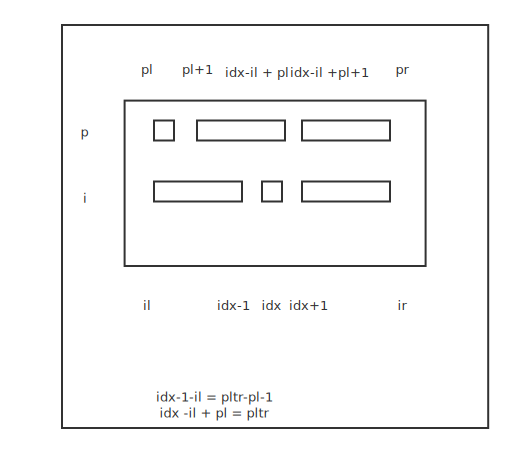

**递归的实现、特性以及思维要点**

递归-循环

调用自己实现循环

代码模板

```go
//递归终结条件
//逻辑代码
//进入下一层
//清理当前层
```

思维要点

1、不要人肉递归

2、找到最近最简单方法，将其拆解成可重复解决的问题（最近重复子问题）

3、数学归纳法思维


**分治法、回溯**

最有重复性-动态规划

最近重复性-分治、回溯

分治法：实质是递归

一个问题化解成好几个子问题

代码模板

```go
//泛型递归
func dfs() {
  //1、递归出口 recursion terminator
  //2、主逻辑 process logic in current level
  //3、代码下探 drill down
  //4、清理环境 reverse the current level status if needed
}
```

```go
//分治法递归
func dfs() {
  //1、递归出口 recursion terminator
  //2、主逻辑 process logic in current level
  //3、代码下探 drill down
  // 组合每个子问题的结果
  //4、清理环境 reverse the current level status if needed
}
```

```go
//回溯法递归 八皇后问题、数独
```

例题 pow(x,n)

n为负数 n = -n， x = 1 / x

例题 子集


前序和中序遍历构造二叉树

找到各个位置的索引；



好理解的方法（当不含重复元素的情况下）：

找到根节点在中序遍历中的索引，开始分割前序和中序遍历结果数组，

逐层画出左右子树结构。

总结：好看的递归带来的是时间上的牺牲，尽可能把能够缓存的数据缓存下来，减少递归中的运算。