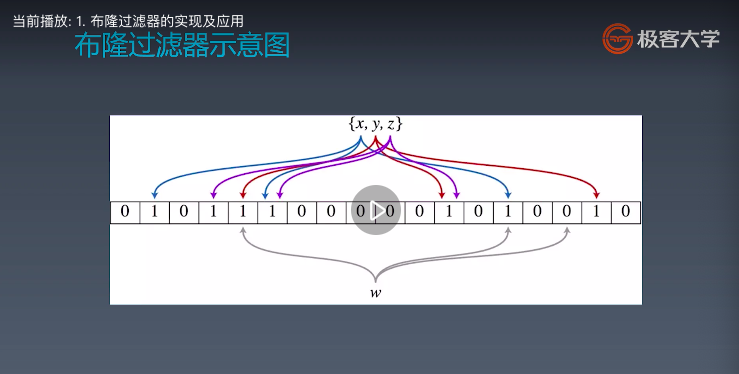

学习笔记

冒泡排序
func bubble() {
    list := []int{7,2,3,4,9}
    for i:=0;i<len(list)-1;i++ {
        for j:=i+1;j<len(list);j++ {
            //根据排序需要设定大于小于号
            if list[i] < list[j] {
                list[i], list[j] = list[j], list[i] 
            }
        } 
    }
}

快排
func fast(list []int, start, end int) {
    if start < end {
        i, j := start, end
        key := list[(start + end) >> 1]
        for i <= j {
            for list[i] < key {
                i++
            }
            for list[j] > key {
                j--
            }
            if i <= j {
                list[i], list[j] = list[j],list[i]
                i++
                j--
            }            
        }
        if start < j {
            fast(list, start, j)
        }
        if end > i {
            fast(list, i, end)
        }
    }
}

//堆排

//插入排序

位运算

布隆过滤器和LRUcache

布隆过滤器（Bloom filter）的实现和应用

引入对比：哈希表

HashTable+拉链存储重复元素

对比：一个很长的二进制向量和一系列随机映射函数。布隆过滤器可以用于检索一个元素是否在一个集合中。

优点：空间效率和查询时间都远远超过一般的算法（模糊的查询方式）

缺点：有一定的误识别率和删除困难

原理：

能确定一个元素确定不存在且肯定不在布隆过滤器里，但是只能确定一个元素可能存在于布隆过滤器里。

案例：

1、比特币网络

2、分布式系统（map-reduce）-hadoop、searchengine

3、Redis缓存

4、垃圾邮件、评论等的过滤

实现布隆过滤器：

bitarray 实现bloom filter

LRU Cache

1、记忆

2、钱包-储物柜

3、代码模块

LRU Cache

两个要素：大小、替换策略

Hash Table + Double LinkedList

O(1)查询

O(1)修改、更新

**替换策略**

LRU-least recently used  最近最少使用

LFU-least frequently used 最近最不经常使用

排序算法

**大类定义**

比较累排序

通过比较来决定元素间的相对次序，由于其时间复杂度不能突破O(nlogn)，因此也称为非线性时间比较累排序。

非比较累排序

不通过比较来决定元素间的相对次序，它可以突破基于比较排序的时间下界，以线性时间运行，因此也称为线性时间非比较累排序。

**分类**

比较累：交换、插入、选择、归并

堆排序、快速排序、归并排序：时间复杂度O（nlogn）

非比较累：计数、桶、基数

初级排序O(n^2)

1、选择排序：每次找最小值，然后放到待排序数组的起始位置，

2、插入排序：从前到后逐步构建有序序列；对于未排序数据，在已排序序列中，从后向前扫描，找到相应位置并插入。

3、冒泡排序：嵌套循环，每次查看相邻的元素，如果逆序，则交换

高级排序O(nlogn)

快速排序

模板：

归并排序-分治

模板

堆排序

堆插入O(logn) 取最大最小O(1)